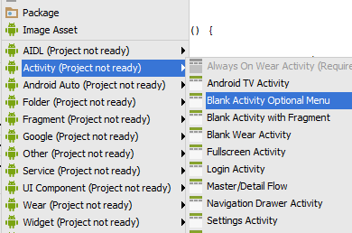

# Blank Activity Optional Menu Template for Android Studio

Template for Android Studio. Lets you create a Blank Activity with or without menu. It also doesn't generate unnecessary "Hello World!" resource.

Copy `BlankActivityOptionalMenu` into `android-studio/plugins/android/lib/templates/activities/` and restart Android Studio.

